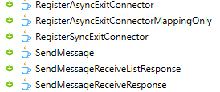
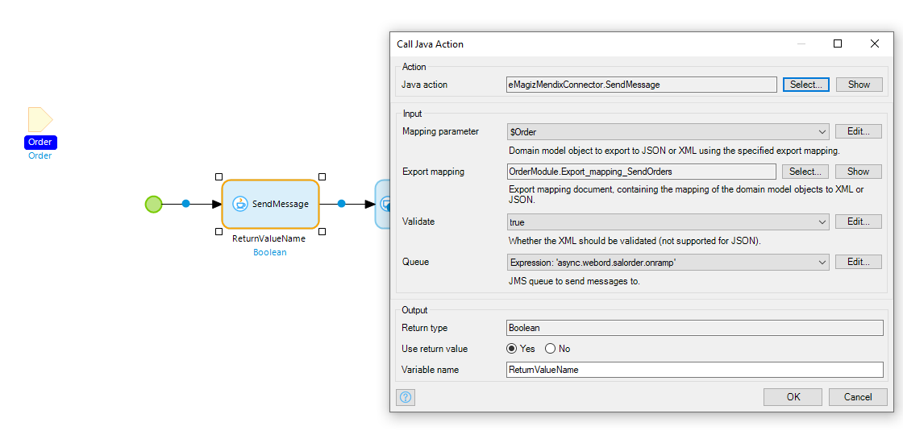
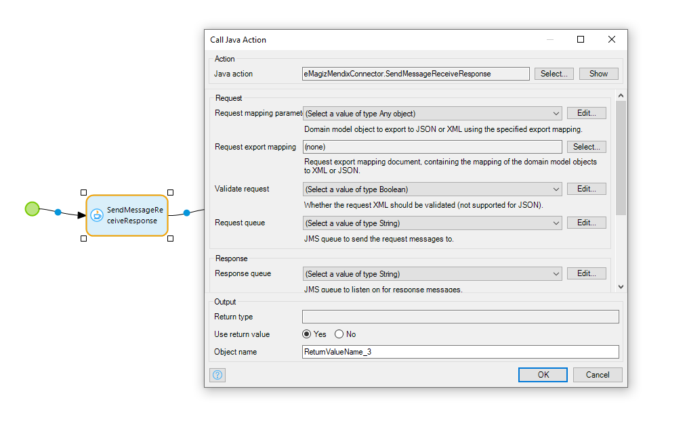
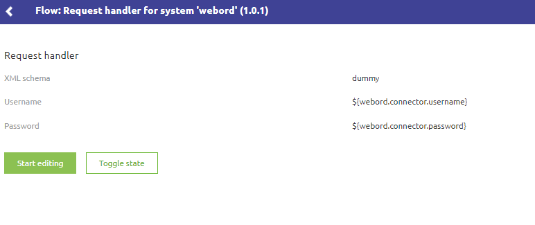

## Introduction User Guide

This document is valid for all eMagiz Mendix connector versions that are currently supported. That includes the most recent addition that support Mendix version 8, which brings some changes in the way the Connector is used.

Last update on March 30th, 2020

## Positioning of the eMagiz Connector for Mendix 8 package

This packages has been created to support clients that are moving towards Mendix 8 in their environment. The latest version of eMagiz ha bee upgraded to use AMQP queues, which effectively means that direct connections from Mendix to onramp and offramp queues can be made. This has a positive effect as less effort is required in Mendix to interact with eMagiz and there is an easier management of the environment as only the infra flows need to be deployed (no exit and entry flows managed in Mendix).

To take benefit from this, eMagiz has released this version to take the first steps in this direction. Below are some more details and instructions to use this new version. Please read these carefully.

**IMPORTANT NOTE**: This version removes the web service layer from the eMagiz Mendix Connector. Mendix now connects to the eMagiz bus directly using Java Actions in microflows. The first upgrade to this new version may take more time for development and testing than previous updates of the eMagiz Mendix Connector. After that, however, it should be easier in use for both Mendix and eMagiz developers. 

Please find the package on the usual location: Under Deploy --> On-premise --> Runtime downloads tab

## Comparing eMagiz Mendix connector

| Mendix V6/V7 Connector| Mendix V8 Connector|
| ------ | ------ |
| Messages received in XML  | Messages received in XML, JSON or Data Model|
| Web service required to receive messages. For sending messages, a Request Handler in the Mendix model is required | Direct connection to the eMagiz queue (onramp/offramp) made via Java Action|
| Each flow (exit, entry and infra) needs to be deployed | Only infra flow needs to be deployed once, microflows connected to the queues directly|
|Incoming webservice|Microflow - Java action details |

## Short instruction video

Please refer to the eMagiz Community page, under Academy to find the session where the eMagiz Mendix Connector is introduced, and where a short example is worked out. In the Module eMagiz ABL Block 1 (Beta sessions) you can find this session.

## Java actions

In essence, there are 2 types of Java actions available that allow to Send and to Receive messages from eMagiz. Both types come in 3 flavors to support the use cases that the Mendix developer needs to interact with eMagiz. After creating the required components in Mendix, the Java actions provided in the package can be configured.

### Sending asynchronous messages via provided Java actions ###
Below the example of the Send Message microflow that contains this Java Action.

1. Mapping parameter - select the Mendix entity that holds the data to be send to eMagiz for further processing
2. Export mapping - ensure to have created a Mendix Export mapping object so that the data can be properly processed by eMagiz. Consider sequence, data types, etc. of attributes to ensure the message can be properly processed
3. Validate - select if message needs to be validate in Mendix
4. Queue - enter the proper value for the onramp queue of eMagiz where the message needs to be put on. Below an example of an onramp queue / select the destination name as queue name.

### Receiving asynchronous messages via provided Java actions ###

1. Queue - enter the proper value for the onramp queue of eMagiz where the message needs to be put on. Below an example of an onramp queue / select the destination name as queue name.
2. Validate - select if message needs to be validate in Mendix
3. Mapping parameter - select the entity that holds the data to be send to eMagiz for further processing
4. Export mapping - ensure to have created a Mendix mapping object so that the data can be properly processed by eMagiz. Consider sequence, data types, etc. of attributes to ensure the message can be properly processed

### Receiving synchronous message request via provided Java actions ###

**Request**
1. Request Queue - enter the proper value for the offramp request queue of eMagiz where the request message needs to be put on.
2. Validate request - 
3. Request Import Mapping - 

**Response**
1. Generate Response Microflow - 
2. Response Limit - 
3. Response export mapping
4. Validate Response -
 
**Message Listeners**
1. Error handling
2. max attempts
3. Back off period
4. Concurrent cinsumers
5. Max concurrent users
6. Idle cosumer limit

### Sending synchronous message request via provided Java actions ###

**Request**
1. Request Mapping parameter - 
2. Request Export mapping - 
3. validate Request - 
4. Request Queue - enter the proper value for the onramp request queue of eMagiz where the request message needs to be put on.

**Response**
1. Response queue - enter the proper value for the onramp queue of eMagiz where the response message needs to be picked up from
2. Validate Response - 
3. Response import mapping
4. Response Object type -

## Key notes in using this package

Please take care of the following items when you start to use this version of the Connector to ensure you can use it properly
- Use supplied Java actions in the eMagiz Mendix connector to set up the connections
- Make a single microflow to register all Message Listeners. Link it to the After Startup microflow
- These 2 libraries could cause issues with the current version of the Connector - please evaluate the necessity of these before deleting them
  - xerces.xercesImpl.2.8.1.jar
  - xmlbeans-3.0.1.jar.ExcelImporter.jar
- In eMagiz the request handler needs to be set with a dummy name. The Request Handler is no longer used, but there is a value expected for now (to fix in future releases of this package).

  

## Planned improvements for 2020
These are the items that the eMagiz team is planning to improve in the course of 2020
- eMagiz Portal changes (e.g. removing deprecated artifacts like the request handlers)  
- Remove the infra configuration and simplify the "Configuration overview" snippet
- Exposing the java-actions as microflow actions