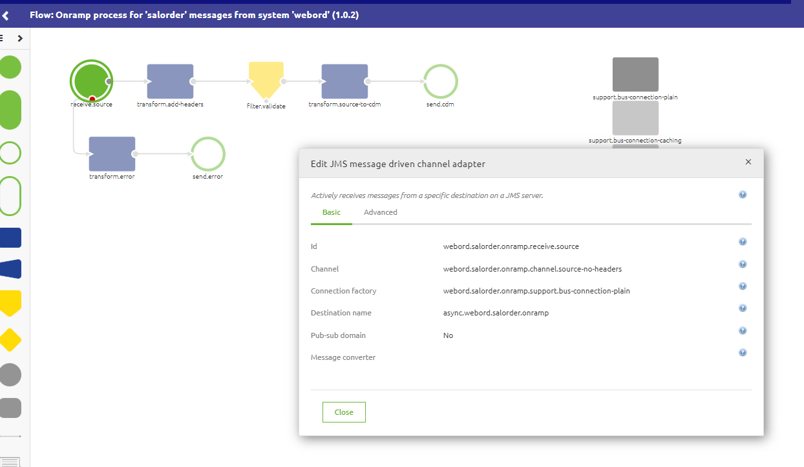
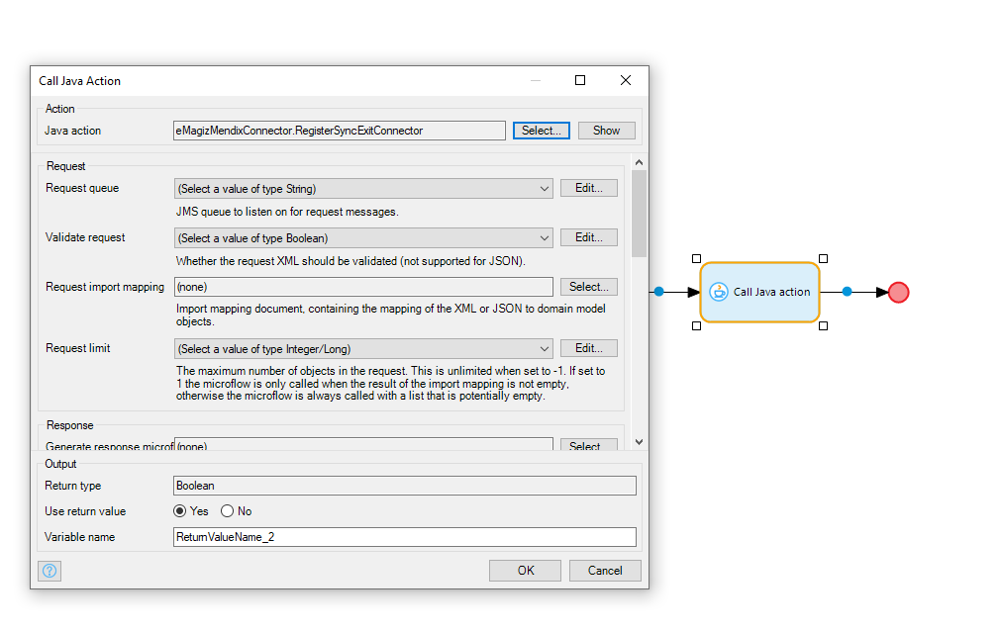

## 1. Introduction User Guide

This document is valid for all eMagiz Mendix connector versions that are currently supported. That includes the most recent addition that support Mendix version 8, which brings some changes in the way the Connector is used.

Last update on May 4th , 2020

## 2. Positioning of the eMagiz Connector for Mendix 8 package

This packages has been created to support clients that are moving towards Mendix 8 in their environment. The latest version of eMagiz ha bee upgraded to use AMQP queues, which effectively means that direct connections from Mendix to onramp and offramp queues can be made. This has a positive effect as less effort is required in Mendix to interact with eMagiz and there is an easier management of the environment as only the infra flows need to be deployed (no exit and entry flows managed in Mendix).

To take benefit from this, eMagiz has released this version to take the first steps in this direction. Below are some more details and instructions to use this new version. Please read these carefully.

**IMPORTANT NOTE**: This version removes the web service layer from the eMagiz Mendix Connector. Mendix now connects to the eMagiz bus directly using Java Actions in microflows. The first upgrade to this new version may take more time for development and testing than previous updates of the eMagiz Mendix Connector. After that, however, it should be easier in use for both Mendix and eMagiz developers. 

Please find the package on the usual location: Under Deploy --> On-premise --> Runtime downloads tab

## 3. Comparing eMagiz Mendix connector

| Mendix V6/V7 Connector| Mendix V8 Connector|
| ------ | ------ |
| Messages received in XML  | Messages received in XML, JSON or Data Model|
| Web service required to receive messages. For sending messages, a Request Handler in the Mendix model is required | Direct connection to the eMagiz queue (onramp/offramp) made via Java Action|
| Each flow (exit, entry and infra) needs to be deployed | Only infra flow needs to be deployed once, microflows connected to the queues directly|
|Incoming webservice|Microflow - Java action details |

## 4. Short instruction video

Please refer to the eMagiz Community page, under Academy to find the session where the eMagiz Mendix Connector is introduced, and where a short example is worked out. In the Module eMagiz ABL Block 1 (Beta sessions) you can find this session.

## 5. Java actions

In essence, there are 2 types of Java actions available that allow to Send and to Receive messages from eMagiz. Both types come in 3 flavors to support the use cases that the Mendix developer needs to interact with eMagiz. After creating the required components in Mendix, the Java actions provided in the package can be configured.

### Sending asynchronous messages via provided Java actions ###
Below the example of the Send Message microflow that contains this Java Action.

1. Mapping parameter - select the Mendix entity that holds the data to be send to eMagiz for further processing
2. Export mapping - ensure to have created a Mendix Export mapping object so that the data can be properly processed by eMagiz. Consider sequence, data types, etc. of attributes to ensure the message can be properly processed
3. Validate - select if message needs to be validate in Mendix
4. Queue - enter the proper value for the onramp queue of eMagiz where the message needs to be put on. Below an example of an onramp queue / select the destination name as queue name.

### Receiving asynchronous messages via provided Java actions ###

1. Queue - enter the proper value for the onramp queue of eMagiz where the message needs to be put on. Below an example of an onramp queue / select the destination name as queue name.
2. Validate - select if message needs to be validate in Mendix
3. Mapping parameter - select the entity that holds the data to be send to eMagiz for further processing
4. Export mapping - ensure to have created a Mendix mapping object so that the data can be properly processed by eMagiz. Consider sequence, data types, etc. of attributes to ensure the message can be properly processed

### Receiving synchronous message request via provided Java actions ###

**Request**
1. Request Queue - enter the proper value for the offramp request queue of eMagiz where the request message needs to be put on.
2. Validate request - Whether the request needs to be validated - works only for XML (not JSON)
3. Request Import Mapping - Import mapping document that contains the mapping from XML or JSON to the domain model object
4. Request limit - The maximum number of objects in the request. When set to -1, it means unlimited. When set to 1 the microflow will only be called when the import mapping is not empty. Other values means that the microflow is always called regardless whether the import mapping is empty or not

**Response**
1. Generate Response Microflow - Microflow that is called when the message is received
2. Response Limit - See request limit above
3. Response export mapping - Export mapping that maps XML/JSON to the domain model object
4. Validate Response - Whether the request needs to be validated - works only for XML (not JSON)
 
**Message Listeners Option**
1. Error handling - Optional, default ERROR-MESSAGE. There are four options to influence the behavior when an error message is generated: 
	a. Generate an error message
	b. Ignore error message
	c. Log error message only
	d. Rollback changes
2. Max. attempts - Optional, default 1. When a delivery problem arises, number of attempts to redeliver the message
3. Back off period - Optional, default 1. Period between the different attempts to redeliver the message
4. Concurrent consumers - Optional, default 1. Static number of consumer that listen to the registered queue - option used to tweak/tune the performance
5. Max. concurrent users - Optional, default 1. Dynamic number of consumer that listen to the registered queue - option used to tweak/tune the performance
6. Idle consumer limit - Optional, default 1. Minimum number of consumers that listen to the registered queue 

### Sending synchronous message request via provided Java actions ###

**Request**
1. Request Mapping parameter - Mendix Domain Model object to export JSON or XML using specified export mapping
2. Request Export mapping - Contains the export mapping from domain model object to XML or JSON
3. Validate Request - Whether request should be validated or not
4. Request Queue - enter the proper value for the onramp request queue of eMagiz where the request message needs to be put on.

**Response**
1. Response queue - enter the proper value for the onramp queue of eMagiz where the response message needs to be picked up from
2. Validate Response - Whether response should be validated or not
3. Response import mapping - Mapping object from XML/JSON to domain model object
4. Response Object type - Output domain model object of the import mapping and input for the microflow

## 6. General steps to move from previous eMagiz Connector versions to this version

1. Locate the name of the queue that interacts with Mendix web service currently in place
2. Remove the Web service components in the Mendix model
3. At the point where this web service component was called, replace it with the appropriate Java action from the Connector module. Use the queue name located in step 1
4. Use the configuration items of the Java action as described in the previous section
5. Leave the eMagiz Request Handler intact for now
6. Test if the messages are properly working

**Key considerations**
- Check if [%CurrentUser%] is not used in the microflow when processing incoming messages. Mendix loses this value when using a Java action microflow. An error message is generated and the message is not processed.
- Understand the impact of the user that is updating/creating the domain model object. The web service user is no longer used to update/create the domain model object
- A best practice can be to store the XSDs of the various integrations into the resources folder of the mendix project so that the entire team has access to the latest
- During restart of the Mendix application, there is no consumer on the synchronous response queues. Once the first message is processed, the consumer will become active. eMagiz alerting will trigger on this scenario which can be considered a false positive.
 

## 7. Key notes in using this package

Please take care of the following items when you start to use this version of the Connector to ensure you can use it properly
- Use supplied Java actions in the eMagiz Mendix connector to set up the connections
- Make a single microflow to register all Message Listeners. Link it to the After Startup microflow
- These 2 libraries could cause issues with the current version of the Connector - please evaluate the necessity of these before deleting them
  - xerces.xercesImpl.2.8.1.jar
  - xmlbeans-3.0.1.jar.ExcelImporter.jar
- In eMagiz the request handler needs to be set with a dummy name. The Request Handler is no longer used, but there is a value expected for now (to fix in future releases of this package).

  
