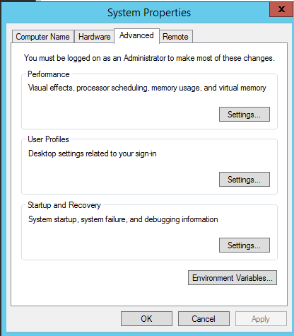
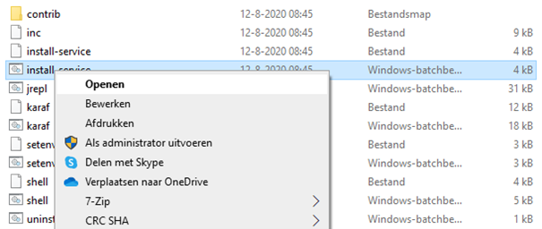
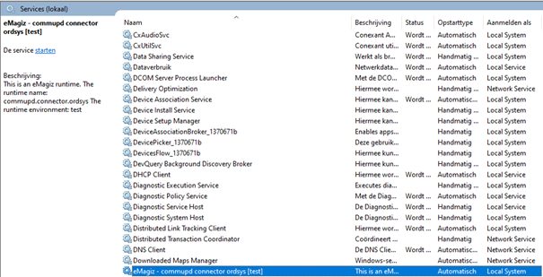
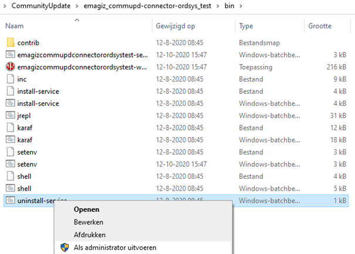

	

		<main class="micro-learning">
		<ul class="doc-nav">
			<li class="doc-nav__item"><a href="../../docs/microlearning/expert-solution-architecture-index" class="doc-nav__link">Home</a></li>
			<li class="doc-nav__item"><a href="#intro" class="doc-nav__link">Intro</a></li>
			<li class="doc-nav__item"><a href="#theory" class="doc-nav__link">Theory</a></li>
			<li class="doc-nav__item"><a href="#practice" class="doc-nav__link">Practice</a></li>
			<li class="doc-nav__item"><a href="#solution" class="doc-nav__link">Solution</a></li>
		</ul>

##### Intro

# Install eMagiz runtime on a local server

In this microlearning, we will focus on installing the eMagiz environment locally for Windows.

Should you have any questions, please contact academy@emagiz.com.

- Last update: November 2021
- Required reading time: 5 minutes

## 1. Prerequisites
To install a runtime, please be aware that eMagiz needs an environment that satisfies certain requirements. These requirements can be different depending on your architectural choices. Most common is the connector inside your network and a JMS and container running outside the network. In that case, if you are running only connectors in this environment, please keep the following requirements in mind:

1. OS with support for Java 
2. OS user with granted security rights to run startup services (Windows services) 
3. The correct Java installation (Java 8 SE JRE for example, https://adoptopenjdk.net) with NO automatic updates. OpenJDK 8 is currently the recommended version for eMagiz installations.
4. NTP synchronization – all eMagiz service instances should use the same time and settings. 
5. Access to the internet 
6. Outbound JMS traffic - port 8443 (and 8444 in case of failover situation) - amqp.emagiz.com / cloudXXXX.emagizcloud.com 
	-	General monitoring data to eMagiz iPaaS 
	-	Specific JMS traffic to eMagiz JMS Server 
7. Outbound HTTPS traffic – port 443 – Specific provisioning data- https://rts.emagiz.com/ws/ / https://repository.emagiz.com    
8. Hardware requirements 
	-	Modern CPU  
	-	Enough Disk Space according to sizing calculations 
9. Enough Memory according to sizing calculations
10. JAVA_HOME variable is properly set

## 2. Key concepts
eMagiz uses a runtime component as a container where flow components can be deployed in. There are infrastructure components that act as flows, and there are functional flow components. Furthermore, there are routing and error flows. By deploying these runtimes across various locations across the integration architecture, you can make these flows work as a chain to realize a complete integration.

##### Theory

## 3. Installing eMagiz on Linux

### 3.1 General remarks

1. To run an eMagiz runtime, the OS of the server should support and have Java installed. The current version is Java 8. eMagiz runtimes with version of 5.x or higher only support Java 8. These runtimes will not run on Java 7 or earlier versions. If you are running on Java 7, or if you need to use an earlier version of the eMagiz runtime, please also check ‘Installing an older version of the eMagiz runtime’.
2. Additional to 1), please do NOT allow automatic updates. Updates in Java 8 are installed in a different directory than the earlier version. This causes that with every update, your JAVA_HOME system variable, which ensures that if you use Java you use that version, should be updated manually by every update. If you update automatically, this will cause issues since the JAVA_HOME variable will not properly set after each update. See the following Q&A question to learn more about the importance of JAVA_HOME when using on-premise connectors: https://my.emagiz.com/p/question/172825635700348986. Since it can be though to find a Java version via the Oracle site, you are advised to download your Java version from https://adoptopenjdk.net.
3. By installing a runtime, you also need an OS user with security rights to run startup services. This is required because installing the corresponding service for a connector will make sure that the connector can independently stop or start without any user intervention. This means that if the server (JMS) restarts, no manual actions are required.
4. Each server has a date and time. An eMagiz service instance use the NTP time protocol. The NTP protocol is a networking protocol for clock synchronization based on UTC time. Synchronizing your server with the NTP protocol ensures that eMagiz runtimes ‘talk’ with the same date and time. This ensures that you prevent for example:
	- That you are not able to reach your connector via the Runtime Dashboard
	- That synchronized communication fails due to time out errors caused by out of sync runtimes instead of that a system fails to response.
5. In order to communicate with other runtimes, that are hosted outside your network, you need access to the internet.
6. For your connector to communicate with your JMS server, the on-premise server needs to open its port 8443 (and 8444 in case of failover) for outgoing communication (from the server point of view). Via this port JMS data is communicated. In ensures for example that you are able to reach the connector via the runtime dashboard and that you can see statistics of the runtime in Manage. Via a different port, your connector will communicate with your container and its flows. eMagiz requires that the server opens its port 443 for outgoing information to communicate the actual messages exchanged.
7. The servers itself has requirements as well. Please ensure that the server has a modern CPU, enough diskspace and enough memory.
Most important is that for each runtime at least 1GB of RAM Memory is available. These calculation is made as follows:
	- 500 MB heap memory
	- 192 MB metaspace memory
	- 100 MB overhead The above is the bare minimum needed to run. 
	
As the number of flows running on a connector increases the memory also needs to be increased. The same logic applies to flows that use up a lot of memory because multiple steps are executed within that flow. Both are solid reasons to use 1GB as a general rule of thumb but at the same time always take into account new developments when setting up the sizing.

### 3.2 Pre-configuration

1)	The first step of this How-To is to make sure before installing that the requirements as stated above are met. 
2)	Go to the server where you need to install the runtime.
3)	Check the JAVA_HOME system variable if it is set and is directed to the correct folder. You can do this by going to ‘This Computer’.

4) Click with your right mouse button on This PC and go to Properties. The following screen pops up and go to Advanced System Settings.

5) Go to Environment Variables.

6) Check if the JAVA_HOME system veriable exists and it directs to the correct JAVA directory. If it does not exists, please add it.

### 3.3 Download runtime

1.	Download the eMagiz runtime of your connector, JMS, or container via the eMagiz Deploy phase in the Containers tab on the server where it needs to be installed. Please note the environment you want the runtime of. If you download the runtime of the wrong environment you will send to or receive data from the wrong environment. For example, you want to test a flow but by downloading the runtime from the incorrect environment you end up sending data to the Production environment. In the case below, we see that we are downloading a connector runtime ordsys for the Test environment.

### 3.4 Unzip the runtime

1.	Unzip your download package into a directory that is not too deep into the directory structure. 
A directory structure that is too deep will cause issues when extracting the runtime.
For example use: C://eMagiz/test
Do not use: C://Programs/eMagiz/test/connector/appeee/installation
2.	Go to the unpacked package and open the folder

### 3.5 Validate the runtime

1.	In the Bin folder, you can validate if the service can make a connection via karaf.bat. 
To check the connection of the service, use the right mouse button then execute the file as Administrator.
Please make sure that before you try this you verify that your JMS is running.

2.	A screen will pop up and will show you the following:
	
	-	Use the command ‘log:tail’ to see the full log. You will see the full stack trace. If the installation is successful, you should see something like this as a result:
		org.eclipse.gemini.blueprint.extender - 2.1.0.RELEASE |  Application context successfully refreshed (ApplicationContext(bundle=nl.capesystemsintegration.demo.bus.commupd.ordsys.connector-infra.spring, config=nl.capesystemsintegration.demo.bus.commupd.ordsys.connector-infra.spring_1.0.0.52.xml))

If you see an error or the popup closes itself immediately, please check the above steps and requirements. If the popup closes this is probably due to a mismatch between the Java version and runtime version. Please look back at the section explaining how to set JAVA_HOME for more information. If all the above steps are correct and you are not able to identify the issue, please contact your implementation partner.

3.	If you see the expected logging, verify in eMagiz if:
-	You can reach the runtime via the runtime dashboard.
-	You see runtime statistics in Manage.

### 3.6 Install the runtime

1.	Install the windows service to ensure that the runtime will automatically start and stop when the server starts, stops or restarts.
You can do this by running the ‘install-service.bat’.

 

2.	Please check if the service is created. This can be viewed via Services in Windows. You can find Services by using the navigation bar of Windows and searching for Services or typ-in ‘Services.msc’ in your run-window (WINDOWS+R) and press enter.
You will find in the list of services your eMagiz runtime service.

If you click on the service, you can either start, stop or restart the service.

3.	Click with your right mouse button on the service and select Properties.
You will see the following screen.

For the start up type, please check Automatically (delayed start)
In the Tab Log On, you are able to change the user that starts this service, if necessary. This mostly occurs when you are requested to use a different user for the service than your windows user due to security reasons.

4.	Check in eMagiz, just as in step 8, if your connector is still running.
5.	Test the connection by sending test messages over the bus. In case of the live environment, contact your technical contact to test for you.
6.	If everything is working correctly, document the steps to access the server and environment and the credentials.

### 3.7 Update the runtime

Before updating please notice the following:
- Make sure that you know under which account the service is currently running and make sure the new runtime will also start under that account.
- In case you have adjusted the memory please check out the following [microlearning](intermediate-solution-architecture-edit-memory-on-premise-runtime-windows.md) on how to make sure that the new runtime will have the same memory

1.	Navigate to Services under Windows and stop the currently running runtime.
2.  Check whether the newly downloaded runtime works as expected by running it under karaf. See section 3.5 of this document of how to verify this.
3.  The moment this all works correctly close the karaf and deinstall the current runtime by pressing uninstall-service in the bin folder

4.  Follow the steps detailed in section 3.6 to correctly install the new runtime.
5.	Ensure that the old installation folder is completly removed from your on-premise server.

## 3.8 Multiple Java versions on same server

When confronted with a situation in which you have to support multiple runtime versions running multiple Java versions this addendum is for you. 

This is mainly the case when both Acceptance and Production connectors are running on the same server on-premise or when you migrate environments through multiple steps. To determine the correct Java version needed for your runtime please see the attached picture detailed under Java runtime and eMagiz runtime compatibility. 
Be warned: These steps need to be taken before you install a runtime. If you have already installed the runtime please use the uninstall-service.bat action to uninstall the service before proceeding. When confronted with this situation on a live environment please first discuss your actions with CAPE support and the customer.
1) Navigate to the folder belonging to the runtime you currently want to install and start
2) Navigate to the bin folder within the runtime installation folder
3) Edit the setenv.bat file via Notepad++ / Kladblok / WordPad
4) Search (CTRL + F) for: rem SET JAVA_HOME and change this to SET JAVA_HOME=<Java path>      The Java path refers to the location (path) where Java (8) is installed. Commonly this path will look like: 	 ‘C:\Program Files\Java\jre1.8.x_xxx’ of ‘C:\Program Files\Java\jdk1.8.x_xxx’.
Be warned: Make sure no spaces are surrounding the ‘=’ character
5) Save the file as administrator to ensure that changes made in the file are also represented in 

##### Practice

## 4. Assignment

Execute these steps in the training environment. Ensure to have both runtimes active, and see if the flows can be seen active in the Runtime Dashboard

## 5. Key takeaways

- eMagiz has a runtime software component that allows running flows inside. It is generic for all types of flows that exist in eMagiz
- Using the JMS and the Container runtimes created by the eMagiz Portal, you can test your work properly during the microlearning training sessions
- Above instructions are also valid for making the installation on a server where a runtime needs to be deployed locally.
 
##### Solution

## 6. Suggested Additional Readings

N/A

## 7. Silent demonstration video

There is no video available for now

</main>

